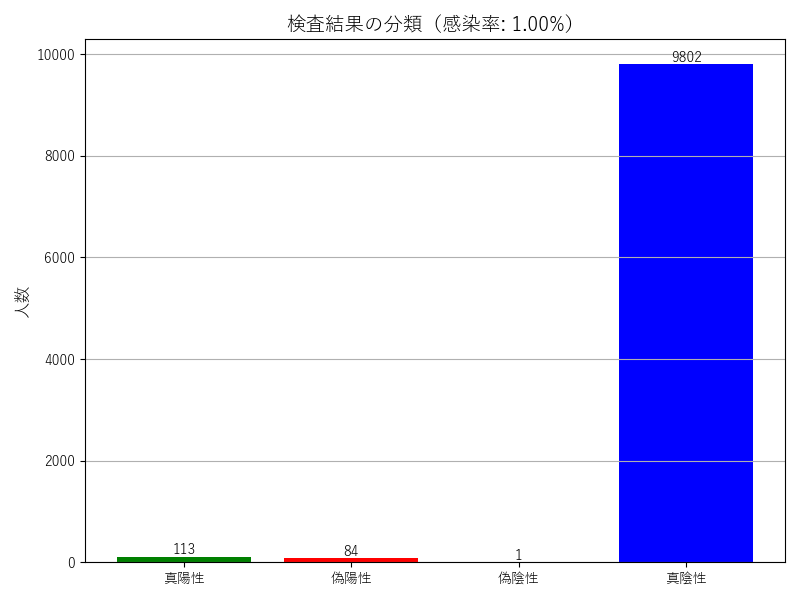

# PCR Simulator / PCRシミュレーター

A Python simulation to demonstrate the counterintuitive nature of PCR test results due to false positives and false negatives.  
偽陽性・偽陰性の影響により、PCR検査の結果が直感に反することを示すPythonシミュレーションです。

---

## 📌 Overview / 概要

This tool simulates how sensitivity, specificity, and infection rate affect the accuracy of PCR tests.  
感度・特異度・感染率の違いが、PCR検査の信頼性にどのように影響するかをシミュレートします。

You can:
- Observe the number of true/false positives and negatives
- Understand why "positive" doesn't always mean "infected"
- Visualize the result in a simple bar chart

できること：
- 真陽性・偽陽性・偽陰性・真陰性の人数を確認できます  
- 「陽性 ＝ 感染」とは限らないことが理解できます  
- 結果をグラフで視覚的に確認できます  

---

## 🧠 What is the Paradox? / このシミュレーションが示すパラドックス

Even a highly accurate PCR test (e.g., 99% sensitivity and specificity) can produce misleading results when the infection rate is low.  
たとえば、感度・特異度がともに99%の検査であっても、感染率が1%の場合、陽性判定の多くが**偽陽性**になります。

This is known as the **False Positive Paradox** — when a disease is rare, the number of false positives can exceed true positives.  
これは **偽陽性のパラドックス**（False Positive Paradox）と呼ばれ、ベイズの定理に基づく直感とのズレを示します。

- High specificity is not enough if prevalence is low.
- Positive ≠ Infected.

---

## 🧩 Logic Overview / ソースコードのロジック

### 🔹 `run(infection_rate: float)`

- Simulates a population of people undergoing PCR testing.
- For each person:
  - Randomly determine if they are infected (based on infection rate)
  - If infected, test result is positive with `sensitivity`
  - If not infected, test result is negative with `specificity`
- Returns:
  - True Positive, False Positive, False Negative, True Negative counts
  - Positive Predictive Value (PPV)

このメソッドでは、各人について以下を確率的に判定します：

1. 感染しているか？ → 感染率に従って乱数で判定  
2. 感染者なら感度、非感染者なら1−特異度で検査結果を決定

---

### 🔹 `display_result(result: dict)`

- Prints results in the terminal.
- Plots a bar chart of:
  - True Positive / False Positive / False Negative / True Negative

結果はターミナルに表示され、4分類の人数を色分けした棒グラフで可視化します。

---

## 🧪 Example Output / 実行例

```bash
▼ Simulation Result ▼
Infection rate: 1.00%
Infected individuals: 91
True positive: 89
False positive: 112
False negative: 2
True negative: 9797
Positive Predictive Value (PPV): 44.28%
````



---

## ⚙️ Parameters / パラメータ

| Parameter         | Default | Description (EN)                                | 説明（日本語）           |
| ----------------- | ------- | ----------------------------------------------- | ----------------- |
| `population_size` | 10000   | Number of people simulated                      | シミュレーション対象の人数     |
| `sensitivity`     | 0.99    | Probability that infected person tests positive | 感染者を正しく陽性と判定する確率  |
| `specificity`     | 0.99    | Probability that healthy person tests negative  | 非感染者を正しく陰性と判定する確率 |
| `infection_rate`  | 0.01    | Proportion of population that is infected       | 母集団における感染者の割合     |

---

## ▶️ How to Run / 実行方法

1. Install `matplotlib` if needed:
   必要に応じて `matplotlib` をインストールします：

   ```bash
   pip install matplotlib
   ```

2. Run the script:
   スクリプトを実行します：

   ```bash
   python pcr_simulator.py
   ```

---

## 📊 Applications / 活用例

* Understanding Bayes' theorem
  ベイズの定理の理解
* Public health education
  公衆衛生教育
* Statistical reasoning and data visualization
  統計的思考とデータ可視化の教材として

---

## 📁 Directory Structure / ディレクトリ構成

```
pcr_simulator/
├── pcr_simulator.py        # Main simulation script / メインスクリプト
├── example_output.png      # Sample graph output / サンプル出力グラフ
└── README.md               # This file / 本ドキュメント
```

---

## 📝 License / ライセンス

MIT License

---

## 🙋 Author / 作者

Created by [taka0766](https://github.com/taka0766)
このプログラムは [taka0766](https://github.com/taka0766) によって作成されました
